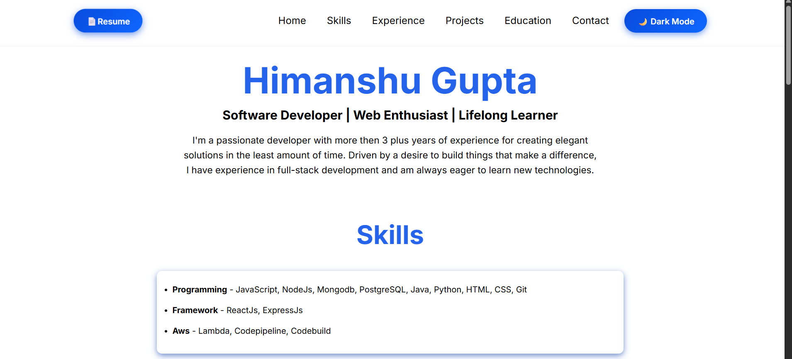
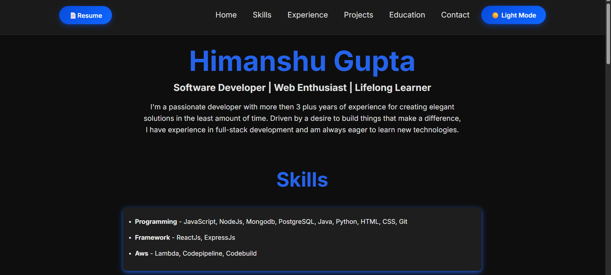
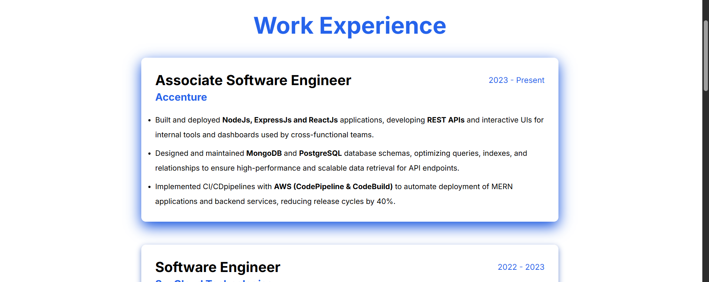
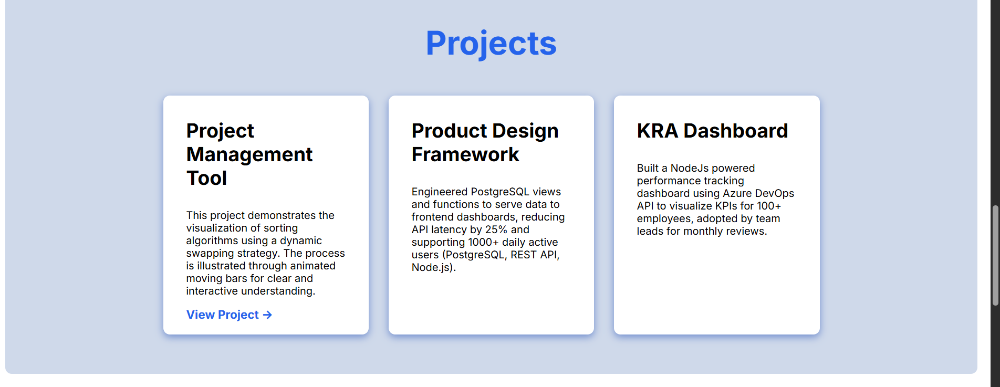
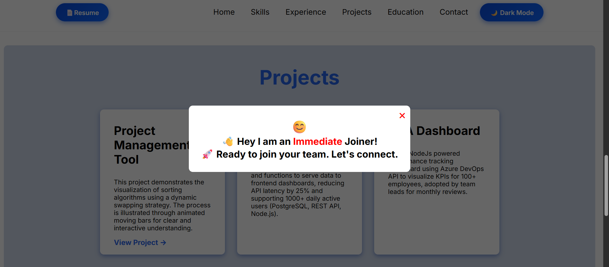
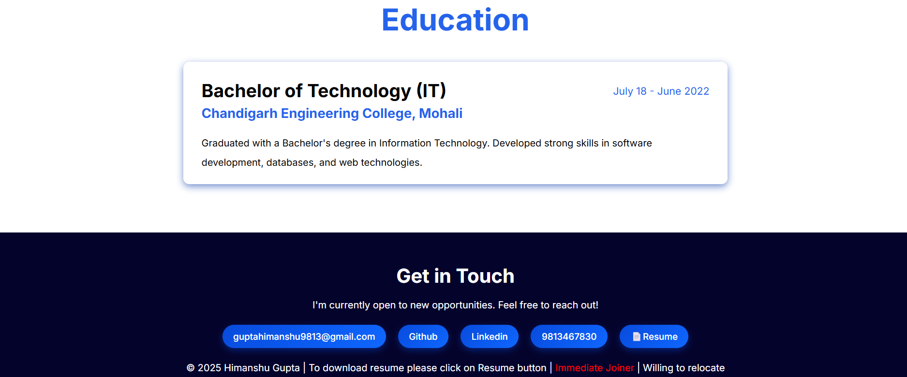

# Himanshu Gupta's Portfolio Website

Welcome to the official repository for my personal portfolio website. This project is designed to showcase my journey, skills, professional experience, and the projects I have worked on. I'm a passionate developer with more then 3 plus years of experience for creating elegant solutions in the least amount of time. Driven by a desire to build things that make a difference, I have experience in full-stack development and am always eager to learn new technologies.

### **[🚀 View Live Portfolio](https://himaanshugupta.github.io/Himanshu-Portfolio/)**

---

## ✨ Features

- **Clean & Modern UI**: A visually appealing and easy-to-navigate interface.
- **Fully Responsive**: Optimized for a seamless experience on all devices, from mobile phones to desktops.
- **Dark Mode**: Switch between light and dark themes for comfortable viewing.
- **Dynamic Sections**: Dedicated sections for my bio, experience, skills, projects, and contact information.
- **Interactive Elements**: Smooth scrolling and hover effects to create an engaging user experience.

---

## 📸 Screenshots

### **Landing Page**

### **Dark Mode Toggle**

### **Experience Section**

### **Projects Section**

### **Pop up**

### **Education & Contact**

---

## 🛠️ Tech Stack

This portfolio is built with modern web technologies to ensure performance and scalability.

-   **Frontend:** HTML5, CSS3, JavaScript
-   **Deployment:** GitHub Pages

---

## 📬 Let's Connect

I'm always open to connecting with new people. Feel free to reach out!

-   ### **[Linkedin](https://www.linkedin.com/in/himanshu-gupta111/)** `[https://www.linkedin.com/in/himanshu-gupta111/]`
-   **Email:** `[guptahimanshu9813@gmail.com]`
-   **GitHub:** `[https://github.com/himaanshugupta]`
